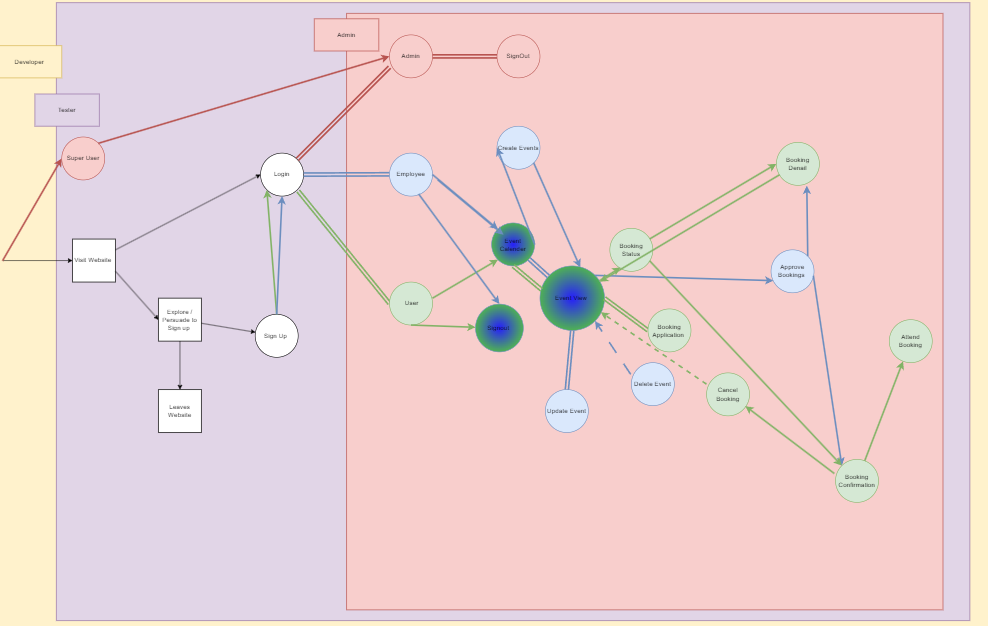
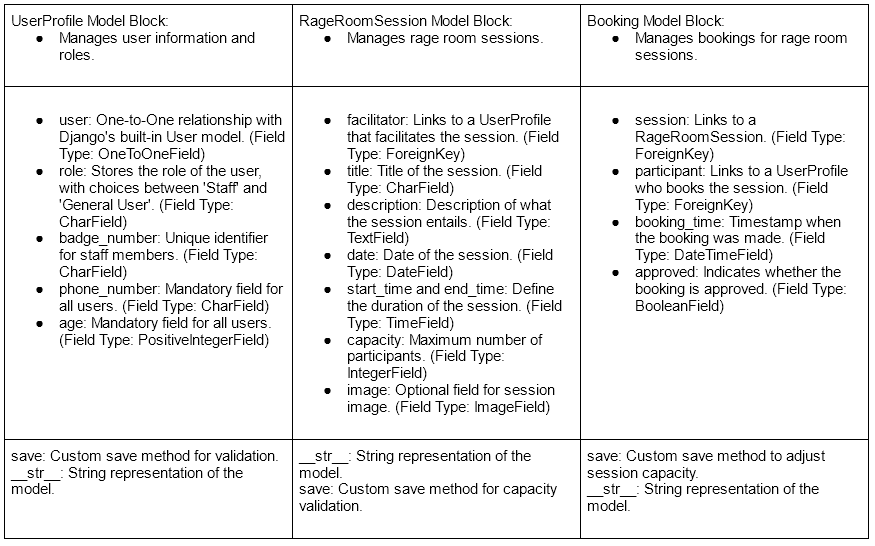

# Rage Room - Booking System   
#### Hackathon 3 - Full Stack Project   

  

#### Project Overview 
The Rage Room booking system is an innovative web application designed to provide a seamless and user-friendly experience for individuals seeking a unique way to vent their frustrations. Targeting professionals aged 25 to 45, this website allows users to view, register, and book for upcoming rage room events. With a focus on intuitive navigation and efficient booking processes, the platform caters to both customers and staff. Customers can easily track their events, while staff members have access to event creation and editing tools, ensuring up-to-date and engaging experiences.

#### Technology Stack
This project is built using a robust technology stack that ensures a smooth and responsive user experience:

- **Backend**: Developed with Django, a high-level Python Web framework that encourages rapid development and clean, pragmatic design.
- **Frontend**: Utilises HTML, CSS, and JavaScript for a dynamic and interactive user interface.
- **Database**: PostgreSQL, known for its reliability and robustness, is used for efficient data storage and retrieval.
- **Version Control**: Git and GitHub for collaborative development and version tracking.
- **Deployment**: The application is deployed on Heroku, a cloud platform service that enables scalable and secure hosting.
- **Additional Libraries and Frameworks**: Use of Django's built-in libraries, Bootstrap for responsive design, and other utilities as required.
 
#### Usage and Features
The Rage Room booking system offers a range of features to enhance user experience:

- **Event Browsing**: Users can easily browse through a list of upcoming rage room events.
- **Registration and Booking**: A streamlined process for user registration and event booking.
- **User Event-Dairy**: Registered users have access to a personal dashboard to track their bookings and events.
- **Admin Panel**: An admin panel for staff to create, modify, and manage events.
- **Responsive Design**: The website is fully responsive, providing a seamless experience on both desktop and mobile devices.

###

#### User Stories and Acceptance Criteria

### 1. User Account Creation
**As a customer, I can create an account so that I can keep track of my events.**

**Acceptance Criteria:**
- Registration system for login/logout.
- Custom user model for customers/general users.

### 2. Intuitive Website Navigation
**As a user, I can navigate the website intuitively so that I can access the website's pages and features.**

**Acceptance Criteria:**
- Responsive navbar with links to pages.
- Dynamic navbar that reveals links based on user authentication.
- Clean and user-friendly design.

### 3. Access to Important Links
**As a user, I can easily see links to T&Cs, social, and contact methods so that I can follow Rage Room or get more information if necessary.**

**Acceptance Criteria:**
- Create a dynamic footer section.
- Include links to social media, T&Cs, Contact details, and location information.

### 4. Event Browsing and Booking
**As a user, I can see available and upcoming events so that I can book a session.**

**Acceptance Criteria:**
- Dynamic list of events on a dedicated page.
- Options to view and book events.

### 5. Tracking Booked Events
**As a user, I can keep track of my booked events so that I can easily manage my schedule.**

**Acceptance Criteria:**
- A page dedicated to booked events.
- Page updates dynamically with options to view event information.

### 6. Event Management for Staff/Admin
**As a staff member/admin, I can add, update, and delete events so that the site is up-to-date.**

**Acceptance Criteria:**
- CRUD functionality for events.
- Add events page for easy management.

### 7. Learning About Rage Room
**As a user, I can learn more about Rage Room so that I know they are the right rage room for me.**

**Acceptance Criteria:**
- An informative About page.
- Information detailing what Rage Room offers.

### 8. Admin Account Creation
**As a staff/admin, I can create an account so that I can manage the website effectively.**

**Acceptance Criteria:**
- Registration process tailored for admin/staff.
- Access to site features available to admin/staff members.

### 9. Viewing the Gallery
**As a user, I can see a gallery of images so that I can see what the Rage Room sessions are like.**

**Acceptance Criteria:**
- A link in the navbar to navigate to the gallery.
- Responsive gallery with images loaded from static files.

### 10. Accessing Terms and Conditions
**As a user, I can read the terms and conditions so that I know the rules of the Rage Rooms.**

**Acceptance Criteria:**
- A link in the footer to access Terms and Conditions.
- A modal popup displaying the T&Cs when clicked.

#### User Persona  
- 25 to 45 years old
- Professional
- In need of a place to vent their frustrations  

#### Specification   
In order to deliver this project we will need to create a booking system with full CRUD functionality.  
This will be achieved by creating 3 models; UserProfile, RageRoomSession, BookingModel.  
These event and booking models will allow us to create a event creation and edit form. We will also have the ability to create a booking form for the average user / customer.  
The event creation and edit form will only be available to staff / admin while the event booking features will be available to all of our registered users.  
We will be using an agile workflow in order to achieve our vision - utlising a kanban board with our user stories to keep track of progress. Each day will start with a stand-up and end with a stand-down so that all team members are up-to-date and any blockers are addressed.

#### Ideation
We are working on setting up a user model for our website. This model needs to handle different kinds of users: from the big bosses to the regular folks just browsing. Django's got a user model already, but it might not be enough, so we are thinking of adding some tweaks to make sure everyone gets the right permissions.  

Then there's the Event Model. This is where all the action happens. It's going to need spaces for the basic stuff like what the event is called, what it's about, when and where it's happening, and who's running the show. All that's going to connect back to whoever's signed up on the site.  

Next up is the Booking Model. This one keeps track of who's signed up for what event. It needs to hook up to both the Event and User models. We will need to keep an eye on when someone books something and whether it's confirmed or not.  
We have also got to make sure the website knows who's who when users log in. This means setting up a system that makes sure everyone's who they say they are and can do only what they're supposed to do on the site.  

For signing up, making events, and booking them, we need to create some forms. Good thing Django has a tool for that which we plan to use. It should make this part easier.  
Then there's creating views. This is about making sure there's a place for everything on the site: adding events, changing them, or even getting rid of them if needed. And we can't forget about making sure users can sign up, log in, and manage their profiles easily.  

While working on the functionality of the website, we also took this time to develop our wireframes. The site's design will be simple in order to allow us to concentrate on the functionality. The colour scheme is inspired by nature. Many animals, when threatened, display strong and contrasting colours to warn all those around. To show they are frustrated and scared. A rage room is for those who need to vent frustration - to let out their inner animal.  

#### Logic Flow

#### Initial Models

#### Design

  
    
## Day 1 
#### Targets
- Set up project models
- Connect project urls
- Finish wireframes
- Set up project kanban board
- Begin working on page templates
- Deploy

#### Issues
- User model issues: Connecting our user models across the different file paths proved to be difficult. 
  
- Design issues: In order to achieve the different background colours for our event's list, we will be implementing Django's cycle tag in the for loop. This is something that we have not tried before so will be interesting to see the outcome.  
Another design issues is the behaviour of our navigation on small screens - the content has been centered in a strange way. This will be solved by adjusting the alignment.

- General set up: As with all Django projects, the initial set up takes a while. This process was exacerbated by the mutliple team members. However, thanks to great leadership, communication, and determination the issues were solved efficiently. These issues mainly revolved around installing the correct packages, adding said packages to the requirements.txt file, ensuring every member had a env.py file set up with the correct links etc.   

## Day 2
#### Targets
- Build up the majority of the website
- Add style to website: Forms, Event List, Home Page, etc
- Begin Testing 
- Bug hunting
- Deploy

#### Issues
Design issues:
- Footer placement. On the majority of our pages, our footer did not stick to the bottom. For larger screens, this has been fixed by adjusting the min-height of the main element and then adjusting each page's height accordingly.  

- Deployment issues - In order for the project to deploy to Heroku, we must ensure that all requirements are included in our requirements.txt and the static files have been collected. Cloudinary has also been set up.

#### Tests
- Forms. In order for the site to have complete CRUD functionality our event forms need to be working. The main issue we are facing is that the events in the event list arent cooperating unless their capacity is set to 10. The forms are also being affected by the footer issue which is stopping interaction with the buttons. The buttons will be fixed by adjusting the relevant screen heights for all necessary breakpoints.  

- Links. All links in the navbar apart from the gallery are currently taking the user to the correct location. The gallery link will be working once the gallery page is set up and the url path is in place. The active class has not been showing up correctly on each page. This was fixed by changing the active class based on the current url pattern.  

## Day 3  
#### Targets  
- Finish update bookings page
- Fix all footer issues
- View event details modal. View events option available to customers and unregistered guests.
- Finish about page  
- Finish gallery page  
- Code validation
- Full test 
- Code housekeeping 
- Final deployment
- Presentation 

#### Tests

#### Hackathon Summary

#### Validation Checkers

#### Testing 

#### Future additions
- Stricter Validation
- Updated styling for event diary
- Update title styling